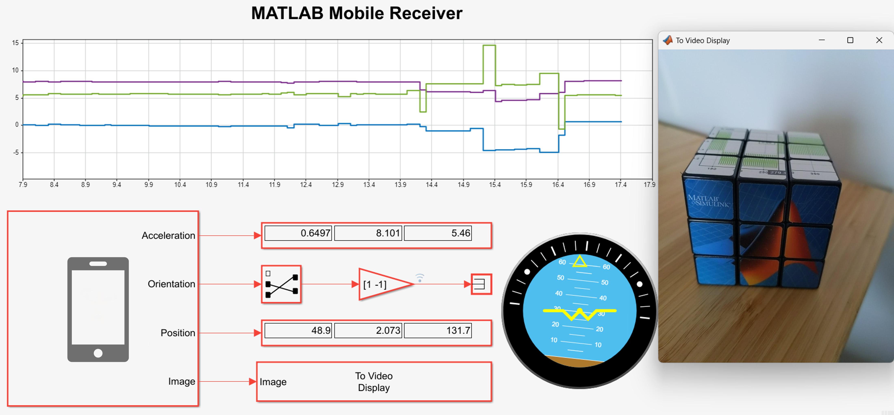

# MATLAB Mobile Receiver
 

Receive sensor data and camera images from MATLAB&reg; Mobile&trade; directly into Simulink&reg;.

## Overview
The **MATLAB Mobile Receiver** block lets you stream live data from a mobile device running MATLAB Mobile into your Simulink model. This includes:

- Built-in sensors:
  - Acceleration  
  - Orientation  
  - Angular Velocity  
  - Magnetic Field  
  - GPS  
- Camera images (RGB frames)

This enables rapid prototyping, algorithm testing, and interactive simulations using real-world mobile data.

### Getting Started

1. Install [**MATLAB Mobile**](https://www.mathworks.com/products/matlab-mobile.html) on your mobile device.
2. Install **MATLAB Support Package for Android Sensors** or **MATLAB Support Package for Apple iOS Sensors** from the Add-On Explorer

On the device, inside MATLAB Mobile:

1. Go to **Sensors > Stream to** and select **MATLAB**.
2. Enable
    - **Sensor Access** -> Sensors > More > Sensor Access
    - **Camera Access**
3. (Optional) On Android, enable **Background Data Acquisition** to allow streaming while the app runs in the background.

### Using the Block

1. Open `MATLABMobileReceiver.prj` in MATLAB.
2. Open `MATLABMobileReceiverExample.slx`.
3. Run the Simulink model.

In the block dialog, enable the outputs you want to stream:

- **Acceleration** outputs device acceleration as `[X Y Z]`.
- **Orientation** outputs device orientation as `[Azimuth Pitch Roll]`.
- **Angular Velocity** outputs angular velocity as `[X Y Z]`.
- **Position** outputs GPS position as `[Latitude Longitude Altitude]`.
- **Magnetic Field** outputs magnetic field as `[X Y Z]`.
- **Camera** outputs RGB camera frames from the selected front or back camera.

Set **Frequency** to control the sensor sample rate in Hz. Set **FPS** to control the camera frame rate, or set **FPS** to `0` to expose an external `Shoot` input that captures a frame when triggered.

### MathWorks&reg; Products

Requires MATLAB release **R2026a** or newer and:
- [MATLAB Mobile](https://www.mathworks.com/products/matlab-mobile.html)
- [Simulink](https://www.mathworks.com/products/simulink.html)
- [MATLAB Support Package for Android Sensors](https://www.mathworks.com/matlabcentral/fileexchange/47618-matlab-support-package-for-android-sensors) or [MATLAB Support Package for Apple iOS Sensors](https://www.mathworks.com/matlabcentral/fileexchange/51235-matlab-support-package-for-apple-ios-sensors)
